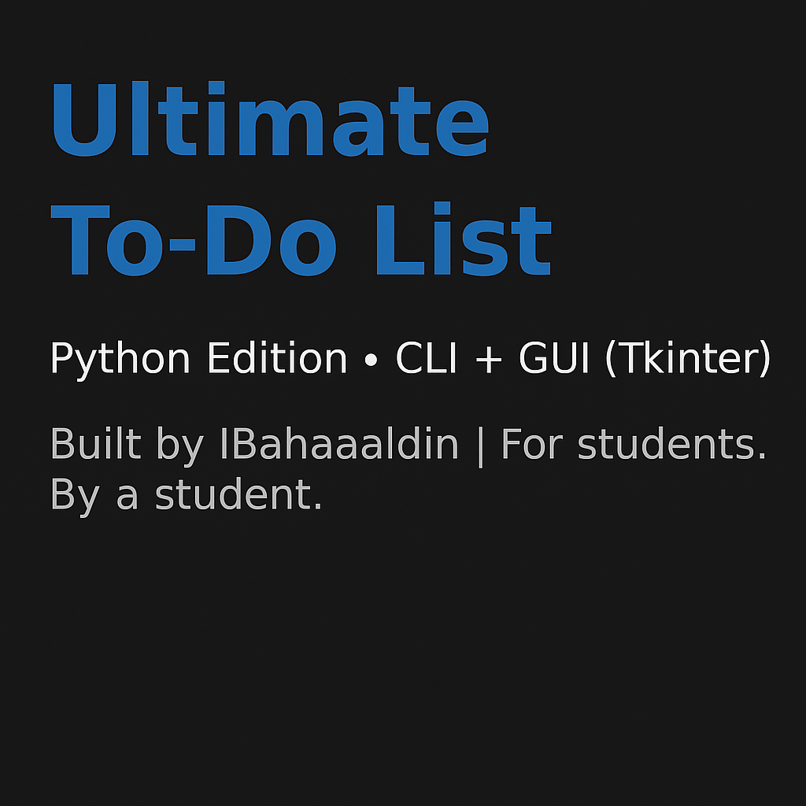

# ✅ Ultimate To-Do List (Python Version)




A professional and modern Python-based To-Do List application designed to boost productivity and organization. Comes with both a Command-Line Interface and a Tkinter-based GUI for enhanced user interaction.

---

## 👤 About the Developer

Created by **IBahaaaldin**, a second-year Computer Science student passionate about developing smart productivity tools. With a focus on practical applications, this project showcases strong error handling, clean code design, and a focus on real-world usability.

---

## 🧠 Project Overview

The **Ultimate To-Do List** is a project for users who want to:

- Organize and track tasks effectively
- Add priorities and deadlines to tasks
- Use a simple CLI or interactive GUI
- Sort tasks and mark them as complete
- Handle mistakes with full input validation
- Export tasks to persistent JSON format

---

## ✨ Features

### ✅ CLI Version (`todo_cli.py`)

- Add, mark complete, delete, sort, and view tasks
- Assign due date and priority (1–5)
- Validate all user input
- Save/load from persistent `tasks.json` file

### ✅ GUI Version (`todo_gui.py`)

- Built with **Tkinter**
- Clean layout with input labels for clarity
- Interactive buttons to manage tasks
- Real-time list update and sort
- Error messages on invalid input
- Auto-saving using shared JSON file

---

## 📷 GUI Screenshot


---

## 📂 File Structure

```
todo-list-python/
├── src/                                # Python source code
│   ├── todo_cli.py                     # CLI To-Do app logic
│   └── todo_gui.py                     # Tkinter-based GUI app
│
├── assets/                             # Visuals used in documentation
│   ├── python_project_banner.png       # Project header image in README.md
│   └── gui_preview.png                 # Screenshot of the GUI
│
├── tasks.json                          # Persistent JSON task file
├── LICENSE                             # MIT license
└── README.md                           # Project documentation
```

---

## ▶️ How to Run

### Run CLI version:

```bash
python3 cli_version/todo_cli.py
```

### Run GUI version:

```bash
python3 gui_version/todo_gui.py
```

---

## 📄 License

This project is licensed under the [MIT License](LICENSE).

---

## 🔁 Related Projects

**Check out the GPA Calculator (Python & Java):**  
👉 [GPA Calculator Python](https://github.com/IBahaaaldin/gpa-calculator-python)  
👉 [GPA Calculator Java](https://github.com/IBahaaaldin/gpa-calculator-java)

---

_Designed to reflect student productivity needs with professional code and thoughtful design._
